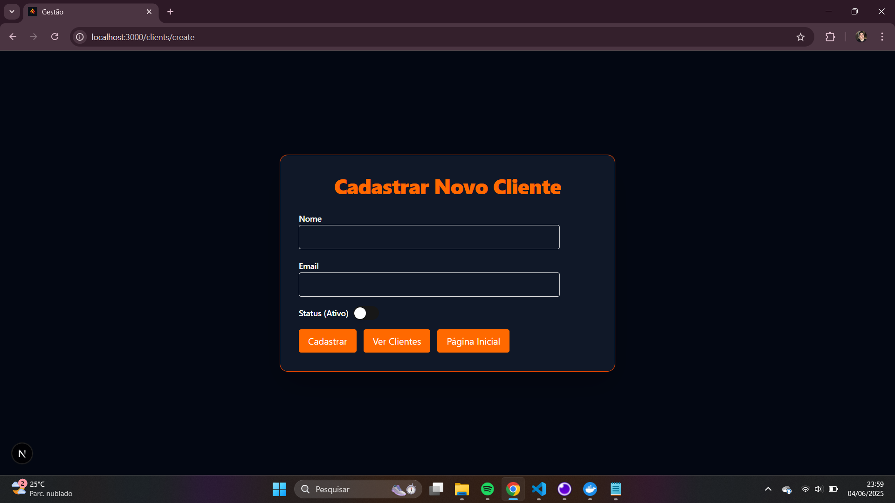

Este projeto é um teste técnico para a Empresa Anka Tech que consiste em uma aplicação fullstack para um escritório de investimentos. 

Com ele, é possível: Cadastrar, listar, editar e excluir clientes; atribuir ativos a clientes e visualizar os ativos de cada cliente.

Este projeto atende aos seguintes requisitos do case: Backend em Node.js (Fastify), Banco de dados relacional MySQL, integração completa entre frontend e backend, Docker Compose orquestrando banco de dados e backend,
código limpo e com validações, arquitetura de pastas organizada, documentação explicando como rodar e frontend em React (Next.js).

As techs utilizadas no backend: Node.js, Fastify, Prisma ORM, TypeScript, MySQL e o Docker Compose.
E no frontend: Next.js, React, ShadCN UI, React Query, React Hook Form, Zod e o Tailwind CSS.

Funcionalidades implementadas: cadastro de clientes, listagem de clientes, listagem de ativos, associação de ativos a clientes com campo quantity, relacionamento entre entidades (Client, Asset, ClientAsset), backend
robusto com validações de dados e frontend com formulários e integração via API.

Para rodar o projeto é necessário ter: Node.js 18+, Docker + Docker Compose, NPM ou Yarn.

Comandos para rodar o projeto:
1. Backend + Banco de Dados

Acesse a pasta do backend
>cd backend

Copie o arquivo de variáveis de ambiente
>cp .env.example .env

Instale as dependências
>npm install

Suba o container com o MySQL (na porta 3307)
>docker compose up -d

Aplique as migrations e gere o client do Prisma
>npx prisma migrate dev --name init
>npx prisma generate

Rode o servidor
>npm run dev

2. Frontend
Acesse a pasta do frontend
>cd frontend

Instale as dependências
>npm install

Rode o servidor de desenvolvimento
>npm run dev

Aqui estão algumas telas da aplicação, mostrando as principais funcionalidades:

<table style="width: 100%;">
  <tr>
    <td style="width: 50%; padding: 10px; vertical-align: top;">
      
       
      
**Tela 1: [Página inicial]**

    </td>
    <td style="width: 50%; padding: 10px; vertical-align: top;">
      
       
      
**Tela 2: [Página de listagem de clientes]**

    </td>
  </tr>
  <tr>
    <td style="width: 50%; padding: 10px; vertical-align: top;">
      
       
      
**Tela 3: [Página de casdastrar novo cliente]**

    </td>
    <td style="width: 50%; padding: 10px; vertical-align: top;">
      
       
      
**Tela 4: [Página de editar cliente]**

    </td>
  </tr>
  <tr>
    <td style="width: 50%; padding: 10px; vertical-align: top;">
      
       
      
**Tela 5: [Página de gerenciar ativos do cliente]**

    </td>
    <td style="width: 50%; padding: 10px; vertical-align: top;">
      
       
      
**Tela 6: [Página de gerenciar ativos do cliente com ativos marcados]**

    </td>
  </tr>
</table>

Considerações finais:
e por fim, esse projeto, que seguiu a dica de ouro, está funcional localmente e cumpre a maioria dos requisitos técnicos propostos.
Espero que a tentativa e o esforço estejam visíveis no código. E muito obrigado, pessoal, pela grande oportunidade!

